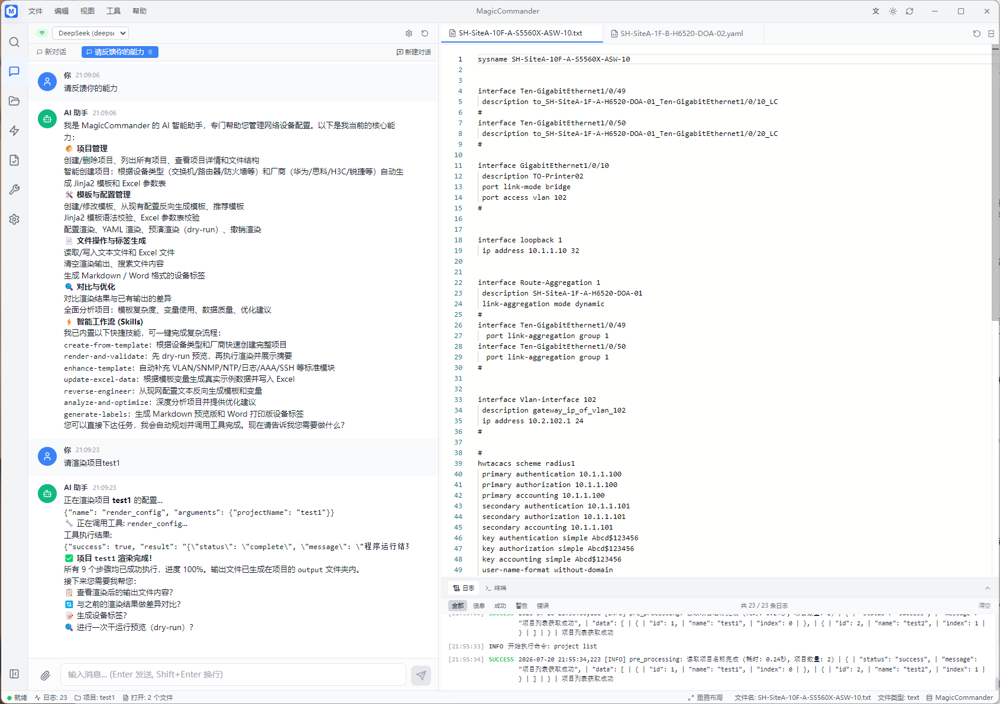
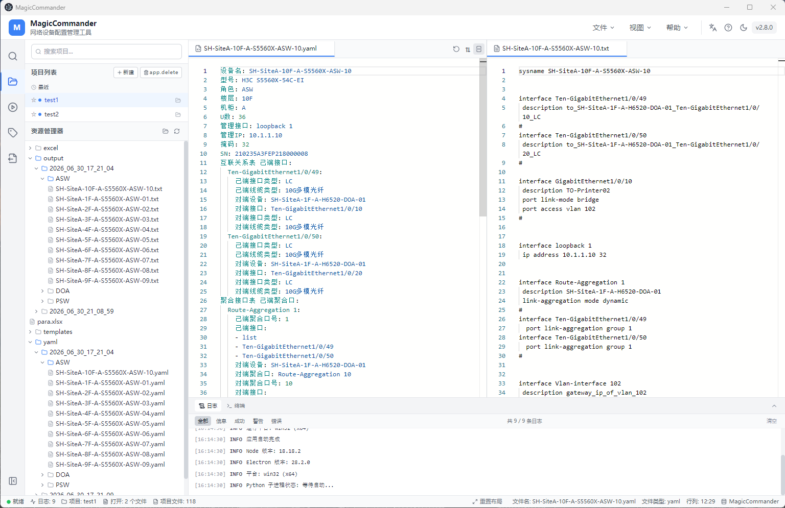

# MagicCommander

**批量生成网络设备配置 | Network Device Configuration Automation**

[](https://github.com/bangbang8000-cell/MagicCommander)
[](LICENSE)
[](https://github.com/bangbang8000-cell/MagicCommander/releases)
[](https://github.com/bangbang8000-cell/MagicCommander/releases)
[](https://github.com/bangbang8000-cell/MagicCommander/releases)
[](https://github.com/bangbang8000-cell/MagicCommander)
[](https://github.com/bangbang8000-cell/MagicCommander)


## 你还在手动配置每一台交换机吗？

运维团队管理着 50 台、200 台甚至 500 台网络设备。每次上新设备、变更 VLAN、调整接口描述，都要逐台登录、逐行敲命令。配置格式不统一，参数容易写错，一个项目下来，光配置交换机就要花掉一整天。

设备标签呢？手写、贴纸、Excel 打印……标签丢失、信息不全、格式混乱，运维交接时面对一堆"无名设备"无从下手。

**MagicCommander 就是为解决这个问题而生的。**

---

## 三步完成批量配置，从一天到一分钟

MagicCommander 将你的网络设备参数（Excel 表格）和设备配置模板（Jinja2 语法）结合起来，一键生成所有设备的标准化配置文件，同时自动生成可打印的设备标签。



**工作原理**：左侧项目浏览器管理模板和 Excel 参数，右侧 AI 对话面板通过自然语言驱动渲染、分析、优化等操作。你用 Jinja2 模板定义配置格式，在 Excel 中维护设备参数，MagicCommander 自动完成拼接和渲染，输出可直接使用的设备配置文件。



---

## 为什么选择 MagicCommander

### 模板一次编写，永久复用

用 Jinja2 语法编写一次配置模板，后续所有项目、所有设备都基于同一套模板生成配置。模板改了，重新渲染即可，不必逐台修改。

```jinja2
interface {{ interface_name }}
 description {{ description }}
 switchport mode access
 switchport access vlan {{ vlan_id }}
 no shutdown
```

### Excel 管理参数，所见即所得

设备参数天然适合用表格管理。MagicCommander 内建 Excel 编辑器，直接在软件里编辑 connection、hostname、ipaddress、parameter 等参数表，无需来回切换工具。

### 一键批量渲染，可追踪进度

选好模板和参数，点击渲染，MagicCommander 逐项目生成配置文件和 YAML 中间文件。渲染进度实时可见，日志清晰记录每一步处理结果。

### 设备标签自动生成，直接打印

从 hostname 表格自动提取设备名、SN、型号、机柜位置、管理 IP 等信息，生成 Word 格式的标签文档，支持 A4/A5 纸张、横纵向打印、自定义每页标签数量。同时支持 Markdown 预览和 PDF 导出，满足不同场景需求。

### 12 种语言，全球团队可用

MagicCommander 支持简体中文、English、日本語、한국어、Français、Deutsch、Español、Português、Русский、العربية（含从右到左布局）、Tiếng Việt、ไทย 共 12 种语言，多语言运维团队无缝协作。

### 离线桌面应用，数据安全可控

MagicCommander 是本地桌面软件（Electron + React + TypeScript），所有数据存放在你的电脑上，无需联网，不上传云端，企业数据安全有保障。

### 专业 Jinja2 编辑器

内建 Monaco Editor（VS Code 同款编辑器），支持 Jinja2 语法高亮、代码补全、多标签页管理，模板编写体验不输专业 IDE。

### AI 智能助手，对话式配置管理

MagicCommander 内建 AI Hub，支持 DeepSeek、OpenAI、Claude、Gemini、Qwen、GLM、Grok、Ollama 等 9 种大模型。通过自然语言对话即可完成项目管理、配置渲染、模板分析、优化建议等操作，无需记忆 CLI 命令。

**AI 对话式工作流示例**：

```
你: "帮我看看 test1 项目有哪些模板，分析一下质量"
AI: [调用 list_projects → 找到 test1]
    [调用 analyze_project → 分析 3 个模板 + 5 个 Excel]
    "test1 项目包含 3 个模板(ASW/DOA/PSW)和 5 个 Excel 文件。
     DOA.j2 复杂度较高(15 个变量)，建议拆分为子模板；
     devices.xlsx 第 3 行有空值，建议补全。"
    
你: "渲染 test1 项目"
AI: [调用 render_config → 生成 22 台设备配置]
    "已生成 22 台设备配置，输出目录: output/。
     需要我 dry-run 预览一下吗？"
```

支持 **智能路由**——根据任务类型（编码/分析/问答/推理）自动选择最优模型。AI 可调用 27 个内置工具，包括项目创建、配置渲染、Excel 分析、模板复杂度评估、dry-run 预演、diff 对比、标签生成、配置反向生成等。

### 模板中心，快速启动项目

从内置示例模板（交换机 ASW/PSW/DOA 配置）一键创建新项目，自动生成标准目录结构（templates / excel / output / yaml）。也可以将现有项目保存为模板，团队复用。

### 渲染预演与校验，配置零差错

渲染前支持 **dry-run 预演**——预览生成结果但不写入文件，确认无误再正式渲染。内置 **Jinja2 语法校验**和 **Excel 数据校验**，提前发现模板错误和参数缺失，避免渲染到一半才报错。渲染结果支持 **diff 对比**，变更一目了然。

### AI 驱动，让配置管理更智能

不只是批量生成工具。MagicCommander 的 AI 引擎能 **分析你的模板质量**、**检测 Excel 数据问题**、**推荐合适的模板**，甚至 **从现有配置反向生成 Jinja2 模板**。用自然语言告诉 AI 你的需求，剩下的交给它。

### 12 种语言，面向全球运维团队

MagicCommander 支持中文（简体/繁体）、English、日本語、한국어、Français、Deutsch、Español、Português、Русский、العربية、Tiếng Việt、ไทย 共 12 种语言，适配全球运维团队需求。

---

## 三分钟上手

### 1. 安装

从 [GitHub Releases](https://github.com/bangbang8000-cell/MagicCommander/releases) 下载对应平台的安装包，双击运行安装向导即可。请确保你的电脑已安装 Python 3.8+。

如果想从源码运行：

```bash
git clone https://github.com/bangbang8000-cell/MagicCommander.git
cd MagicCommander
npm install
npm run dev:all
```

### 2. 创建项目

打开 MagicCommander，点击左侧活动栏的项目浏览器图标，新建一个项目。项目会自动生成 `templates / excel / output / yaml` 四个目录。

### 3. 编写模板 + 填写参数 + 一键渲染

在 `templates` 目录下创建 `.j2` 模板文件，在 `excel` 目录下填写设备参数，切换到工作台面板，点击"开始渲染"——配置文件即刻生成到 `output` 目录。

---

## 项目结构

```
项目名称/
├── templates/       # Jinja2 模板 (.j2)
├── excel/           # 设备参数表 (.xlsx)
├── output/          # 生成的配置文件 (.txt)
├── yaml/            # 生成的 YAML 中间文件
└── output-label/    # 生成的设备标签 (.docx / .md / .pdf)
    └── 2026_07_16_01_02_03/   # 按时间戳组织
        ├── xxx_label.docx
        ├── xxx_label.md
        └── xxx_label.pdf
```

---

## 技术栈

Electron 28 · React 18 · TypeScript 5 · Vite 5 · TailwindCSS 3 · Zustand 4 · Monaco Editor 4 · Python 3 · Jinja2 · FastAPI · LangChain

## 项目架构

```
MagicCommander/
├── src/                  # 前端 (Electron + React)
│   ├── components/       # UI 组件 (chat, layout, sidebar, dialogs)
│   ├── stores/           # Zustand 状态管理
│   ├── i18n/             # 12 语言国际化
│   └── types/            # TypeScript 类型定义
├── backend/              # Python CLI 后端
│   ├── main.py           # 统一命令行入口
│   ├── analyzer.py       # 项目分析引擎 (模板复杂度/Excel质量/交叉引用)
│   └── requirements.txt  # Python 依赖
├── ai_hub/               # AI Hub 服务 (FastAPI)
│   ├── api/              # REST API 端点
│   ├── agent/            # Agent 框架 (27 Tools + Tool Calling)
│   └── prompts/          # LLM 系统提示词与工具规范
├── electron/             # Electron 主进程
├── public/               # 静态资源 (图标/文档)
├── resources/            # 嵌入式 Python 运行时
└── docs/                 # 开发文档与计划
```

---

## 快捷键

| 快捷键 | 功能 |
|--------|------|
| `Ctrl+B` | 切换侧边栏 |
| `Ctrl+J` | 切换底部面板 |
| `Ctrl+S` | 保存当前文件 |
| `Ctrl+W` | 关闭当前标签页 |
| `Ctrl+Shift+T` | 重新打开最近关闭的标签 |
| `Ctrl+Shift+E` | 切换到项目浏览器 |
| `Ctrl+Shift+F` | 切换到搜索面板 |
| `Ctrl+Shift+R` | 切换到工作台 |

---

## 常见问题

**Q: 渲染失败怎么办？**

检查 Python 是否已安装（`python --version`），确认已执行 `pip install -r backend/requirements.txt` 安装依赖，再检查 Excel 参数表格式和模板语法是否正确。

**Q: Excel 文件打不开？**

确认文件格式为 `.xlsx` 或 `.xls`，且未被其他程序（如 Microsoft Excel）占用。

**Q: 如何恢复项目数据？**

所有项目数据存储在本地 `backend/` 目录下，备份该目录即可。删除项目前会有二次确认弹窗，避免误操作。

---

## 版本历史

| 版本 | 日期 | 更新内容 |
|------|------|---------|
| **3.4.1 Build 26072006** | 2026-07-20 | 修复关于对话框版本号显示问题，触发正式编译发布 |
| **3.4.0 Build 26072004** | 2026-07-20 | **Agent v2 智能编排引擎**：Planner/Validator/Context/Recovery/Reporter 五层架构、Skills Engine (7 预置 Skill + 半自动生成)、Memory System (用户画像+项目历史+操作习惯)、工具权限分级 (auto/notify/confirm) + 自主模式、27 工具 Agent 框架；**Chat UI 全面重构**：会话横向标签栏 + 溢出历史下拉、AI 自动提炼会话标题、模式/自主模式精简到设置、字体大小可调节、清除/新建图标语义修正；**可靠性修复**：render/dry-run JSON 解析 (平衡括号提取)、工具结果进度过滤、XML/JSON 截断容错解析、确认级工具权限修正 (semi_auto 也需确认) |
| **3.3.2 Build 26072003** | 2026-07-20 | AI 工具集扩展 (14→27 工具)、项目分析引擎 (analyze_project)、自动优化建议、Logo 加载修复 (file:// 协议兼容)、i18n 多语言完善 (修复 12 处硬编码文本) |
| **3.3.1 Build 26072002** | 2026-07-20 | 多 Provider 策略路由 (智能路由引擎)、tool_calls XML 格式解析 + 参数名自动修正、CLI 项目名支持 (非数字 ID)、Windows GBK 编码修复、system.md 提示词增强 |
| **3.3.0 Build 26071901** | 2026-07-19 | AI Hub 核心功能：FastAPI 子进程生命周期管理、9 LLM Provider (DeepSeek/OpenAI/Claude/Gemini/Qwen/GLM/Grok/Ollama/自定义)、Agent 框架 (14 Tools)、SSE 流式响应、AI 对话 Chat UI、设置面板 AI 配置 (测试连接/获取模型)、语言/主题/更新 Popover 下拉菜单 |
| **3.1.0 Build 26071702** | 2026-07-17 | Phase 1 体验升级：模板中心（示例模板 + 从模板创建项目）、dry-run 渲染预演、Jinja2 语法校验、Excel 数据校验、diff 对比、搜索增强（输出文件类型过滤）、ResizeHandle 拖拽修复 |
| **3.0.4 Build 26071602** | 2026-07-16 | Phase 0 质量基线：Jinja2 语法高亮（Monaco Editor + vscode-textmate）、Markdown 标签生成与 PDF 导出、输出目录统一重构（output-label/时间戳/）、搜索面板 Markdown 类型过滤、中栏项目浏览器布局优化（多选批量操作、拖拽分栏、排序切换） |
| **3.0.3 Build 26071601** | 2026-07-16 | 完成 Phase 0 质量基线：渲染缓存/撤销、Python CLI 统一入口、结构化日志、ESLint/Prettier 配置、26 个自动化测试 |
| **3.0.1 Build 26071402** | 2026-07-14 | 修复文件菜单新建项目弹窗触发、示例模板列表、项目渲染 Python 失败、另存为示例 API 缺失等问题，并同步 Electron 构建产物 |
| **3.0.0 Build 26071401** | 2026-07-14 | V3.0 正式版：采用 `V{MAJOR}.{MINOR}.{PATCH} Build {YYMMDDNN}` 版本规则；新增发布版检查更新/下载/重启安装入口，优化终端 help 布局与右键复制，完善日志分类展示，并将 Actions 发布流程调整为仅在版本 tag 推送后触发编译发布 |
| 2.9.9 | 2026-07-13 | 完善日志与终端体验：日志接入后台命令输出，支持信息/成功/警告/错误分类、搜索和来源标签；终端首次打开自动显示 help，并增强多语言支持 |
| 2.9.8 | 2026-07-13 | 以本地程序和数据为准同步工作区、示例项目与界面优化 |
| 2.9.2 | 2026-07-01 | 跨平台编译支持：Windows (NSIS) / macOS (DMG x64+arm64) / Linux (AppImage+deb) |
| 2.9.1 | 2026-07-01 | 多语言国际化支持（12 种语言）、RTL 布局支持、UI 优化 |
| 2.1.0 | 2026-06-22 | 修复文件显示问题，优化布局 |
| 2.0.0 | - | 重构为 Electron + React 架构 |

---

## V3.0 路线图

MagicCommander V3.0 将从"配置批量生成工具"升级为 **AI 驱动的网络配置工程平台**，分四个阶段推进：

| 阶段 | 时间 | 状态 | 核心交付 |
|------|------|------|---------|
| [Alpha](https://github.com/bangbang8000-cell/MagicCommander/milestone/1) | 2026.07 - 2026.09 | 进行中 | AI Hub 框架 + 智能项目初始化 + 配置反向生成 + 模板调试沙盒 |
| [Beta](https://github.com/bangbang8000-cell/MagicCommander/milestone/2) | 2026.10 - 2026.12 | 待开始 | 智能校对 + AI 对话助手 + Excel/Jinja2 增强 + 模板资产中心 |
| [GA](https://github.com/bangbang8000-cell/MagicCommander/milestone/3) | 2027.01 - 2027.03 | 待开始 | 社区分享中心 + 协作审阅 + 项目生命周期 + 权限体系 + 多 LLM Provider |
| [Scale](https://github.com/bangbang8000-cell/MagicCommander/milestone/4) | 2027.04 - 2027.06 | 待开始 | Git 集成 + Ansible/Nornir 推送 + 多租户 + 监控告警 |

**Alpha 阶段已完成**：AI Hub 核心框架 (FastAPI + 9 LLM Provider + Agent v2 27 Tools + SSE 流式)、Smart Agent 编排引擎 (Planner/Validator/Recovery/Skills/Memory)、AI 对话 Chat UI (会话标签+AI 标题)、多 Provider 智能路由、项目分析引擎 (analyze_project)、配置反向生成 (reverse_engineer_config)、模板推荐 (recommend_template)。

**核心新增能力**：
- AI 智能中心：借助大模型 API 实现配置生成、校对、优化建议、对话助手
- 模板资产中心：结构化模板库 + 版本管理 + 质量评级 + 调试沙盒
- 社区分享中心：模板/项目一键分享 + 公共社区广场 + 创作者体系
- 技术栈扩展：FastAPI (AI Hub) + LangChain/LiteLLM (LLM 统一调度) + Ollama (本地模型)

**产品需求文档**：[PRD v2.0](docs/prd/magiccommander-prd_v2.0_2026-07-07/magiccommander-prd_v2.0_2026-07-07.html) | **开发计划与规范**：[Dev Spec v2.0](docs/spec/magiccommander-dev-spec_v2.0_2026-07-14/magiccommander-dev-spec_v2.0_2026-07-14.html) | **文档索引**：[docs/](docs/)

---

## 参与贡献

欢迎提交 Issue 和 Pull Request。如有功能建议或问题反馈，请在 GitHub Issues 中提出。

**搜索引擎关键词**：网络设备配置批量生成、交换机配置自动生成、Jinja2 网络配置工具、网络运维自动化、设备标签打印、批量生成设备配置

---

## 许可证

[MIT License](LICENSE)
