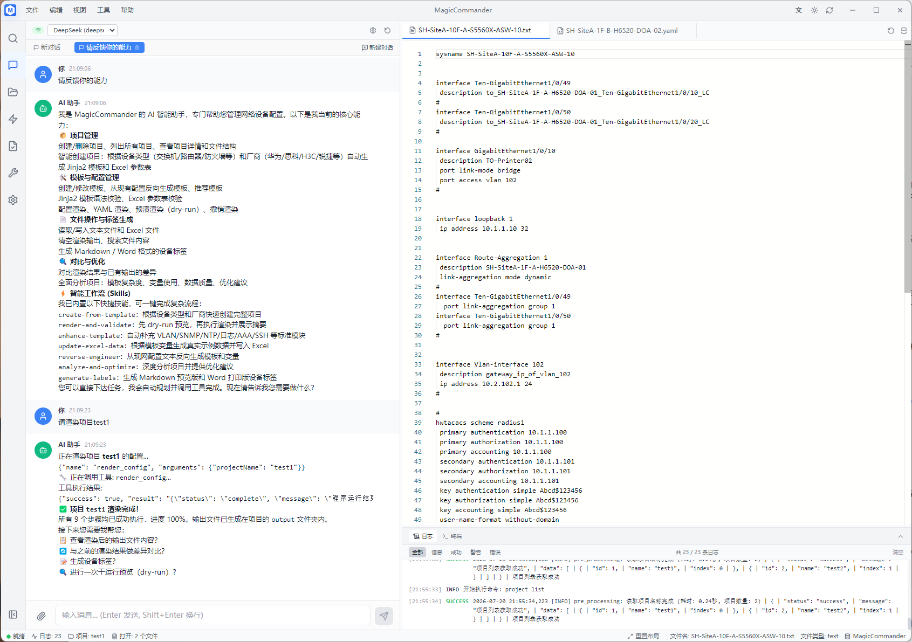
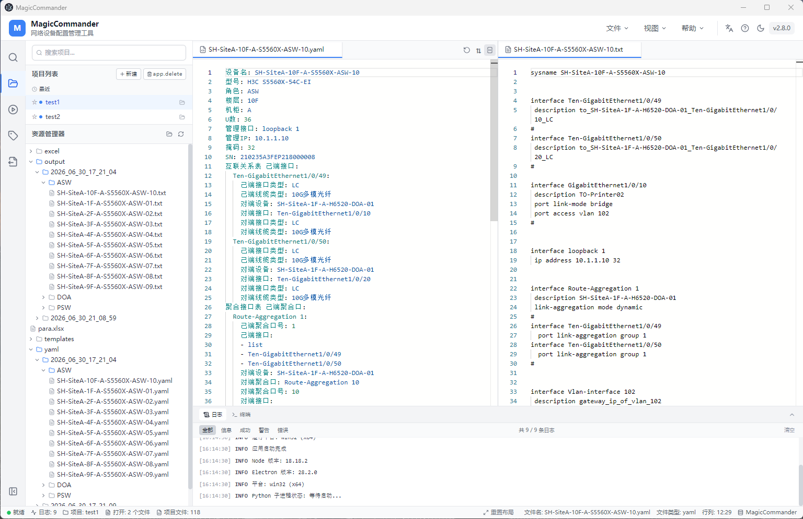

# MagicCommander

**批量生成网络设备配置 | Network Device Configuration Automation**

[](https://github.com/bangbang8000-cell/MagicCommander/releases)
[](LICENSE)
[](https://github.com/bangbang8000-cell/MagicCommander/releases)
[](https://github.com/bangbang8000-cell/MagicCommander/releases)
[](https://github.com/bangbang8000-cell/MagicCommander/releases)
[](https://github.com/bangbang8000-cell/MagicCommander)
[](https://github.com/bangbang8000-cell/MagicCommander)
[](https://github.com/bangbang8000-cell/MagicCommander/actions)
[](https://github.com/bangbang8000-cell/MagicCommander/actions)


## 你还在手动配置每一台交换机吗？

运维团队管理着 50 台、200 台甚至 500 台网络设备。每次上新设备、变更 VLAN、调整接口描述，都要逐台登录、逐行敲命令。配置格式不统一，参数容易写错，一个项目下来，光配置交换机就要花掉一整天。

设备标签呢？手写、贴纸、Excel 打印……标签丢失、信息不全、格式混乱，运维交接时面对一堆"无名设备"无从下手。

**MagicCommander 就是为解决这个问题而生的。**

---

## 三步完成批量配置，从一天到一分钟

MagicCommander 将你的网络设备参数（Excel 表格）和设备配置模板（Jinja2 语法）结合起来，一键生成所有设备的标准化配置文件，同时自动生成可打印的设备标签。



**工作原理**：左侧项目浏览器管理模板和 Excel 参数，右侧 AI 对话面板通过自然语言驱动渲染、分析、优化等操作。你用 Jinja2 模板定义配置格式，在 Excel 中维护设备参数，MagicCommander 自动完成拼接和渲染，输出可直接使用的设备配置文件。



---

## 为什么选择 MagicCommander

### 模板一次编写，永久复用

用 Jinja2 语法编写一次配置模板，后续所有项目、所有设备都基于同一套模板生成配置。模板改了，重新渲染即可，不必逐台修改。

```jinja2
interface {{ info['接口名'] }}
 description {{ info['终端名称'] }}
 switchport mode access
 switchport access vlan {{ info['接入VLAN'] }}
 no shutdown
```

### Excel 管理参数，所见即所得

设备参数天然适合用表格管理。MagicCommander 内建 Excel 编辑器，直接在软件里编辑 connection、hostname、ipaddress、parameter 等参数表，无需来回切换工具。

### 一键批量渲染，可追踪进度

选好模板和参数，点击渲染，MagicCommander 逐项目生成配置文件和 YAML 中间文件。渲染进度实时可见，日志清晰记录每一步处理结果。**渲染带输入指纹缓存**——参数与模板未变化时，再次渲染直接复用上次结果，秒级完成。

### 渲染预演与校验，配置零差错

- **dry-run 预演**：预览生成结果但不写入文件，确认无误再正式渲染
- **Jinja2 语法校验**：渲染前解析模板，提前发现语法错误
- **Excel 数据校验**：检查必要 sheet、列、空值、类型异常
- **diff 对比**：预演结果与已有输出一键对比，变更一目了然

### 设备标签自动生成，直接打印

从 hostname 表格自动提取设备名、SN、型号、机柜位置、管理 IP 等信息，生成 Word/Markdown 格式的标签文档，支持 A4/A5 纸张、横纵向打印、自定义每页标签数量，可导出 PDF。

### Jinja2 专业编辑器 + 智能补全

内建 Monaco Editor（VS Code 同款编辑器），支持 Jinja2 语法高亮、代码补全、多标签页管理。**智能补全会从项目 Excel 参数表自动提取字段名**，输入 `info['` 即可获得字段提示；切换标签页不再丢失编辑器的撤销历史。

### 跨项目全文搜索

搜索面板支持单项目与**全部项目**两种范围，可按文件名或文件内容搜索，文件类型可过滤（模板/Excel/输出/文本等），结果可一键跳转编辑。

### 模板资产中心

内置示例模板（交换机 ASW/PSW/DOA 配置）一键创建新项目；支持将现有项目保存为模板供团队复用；**每个模板自动进行质量评级（A/B/C/D）**，基于变量复杂度、Excel 数据质量与交叉引用打分，帮助快速判断模板质量。

### AI 智能助手，对话式配置管理

MagicCommander 内建 AI Hub，支持 DeepSeek、OpenAI、Claude、Gemini、Qwen、GLM、Grok、Ollama 等 9 种大模型。通过自然语言对话即可完成项目管理、配置渲染、模板分析、优化建议等操作。

**AI 对话式工作流示例**：

```
你: "帮我看看 test1 项目有哪些模板，分析一下质量"
AI: [调用 list_projects → 找到 test1]
    [调用 analyze_project → 分析 3 个模板 + 5 个 Excel]
    "test1 项目包含 3 个模板(ASW/DOA/PSW)和 5 个 Excel 文件。
     DOA.j2 复杂度较高(15 个变量)，建议拆分为子模板；
     devices.xlsx 第 3 行有空值，建议补全。"

你: "渲染 test1 项目"
AI: [调用 render_config → 生成 22 台设备配置]
    "已生成 22 台设备配置，输出目录: output/。
     需要我 dry-run 预览一下吗？"
```

支持 **智能路由**——根据任务类型（编码/分析/问答/推理）自动选择最优模型。AI 可调用 27 个内置工具，包括项目创建、配置渲染、Excel 分析、模板复杂度评估、dry-run 预演、diff 对比、标签生成、配置反向生成等。

### Cloud Connect — 云平台集成

MagicCommander 支持连接自建 MagicCommander Platform（基于 Gitea + FastAPI）实现团队协作：

- **模板市场**：浏览、搜索、安装云端模板，支持按分类筛选
- **项目同步**：本地项目一键推送至云端，云端项目拉取到本地，自动检测同步状态
- **QR 扫码登录**：支持飞书 / QQ / 微信扫码登录，JWT Token 自动刷新
- **通知中心**：实时接收平台公告和版本更新提醒
- **用户资料**：云端用户档案管理，支持平台账号绑定

### 6 种语言，全球团队可用

支持简体中文、繁體中文、English、日本語、한국어、Français 共 6 种语言（含 RTL 适配），多语言运维团队无缝协作。

### 离线桌面应用，数据安全可控

MagicCommander 是本地桌面软件（Electron + React + TypeScript），所有数据存放在你的电脑上，无需联网，不上传云端，企业数据安全有保障。

### 可靠与安全

- 内建渲染缓存、单实例锁、渲染进程崩溃自动恢复
- Jinja2 模板沙箱执行，杜绝模板恶意代码执行
- 路径白名单 + 输入校验，杜绝越权读写
- API Key 本地加密存储，云平台管理接口鉴权

---

## 三分钟上手

### 1. 安装

从 [GitHub Releases](https://github.com/bangbang8000-cell/MagicCommander/releases) 下载对应平台的安装包，双击运行安装向导即可。Windows 版本已内嵌 Python 运行时，无需单独安装。

如果想从源码运行：

```bash
git clone https://github.com/bangbang8000-cell/MagicCommander.git
cd MagicCommander
npm install
pip install -r backend/requirements.txt
npm run dev:all
```

### 2. 创建项目

打开 MagicCommander，点击左侧活动栏的项目浏览器图标（或使用顶部**文件 → 新建项目**菜单；**文件 → 最近项目**可一键打开历史项目），新建一个项目。项目会自动生成 `templates / excel / output / yaml` 四个目录。也可以从 **模板中心** 的内置示例模板一键创建。

### 3. 编写模板 + 填写参数 + 一键渲染

在 `templates` 目录下创建 `.j2` 模板文件（带智能补全），在 `excel` 目录下填写设备参数，切换到工作台面板——工作台按三步分组：①**配置与就绪**（项目/参数就绪度）→ ②**渲染材料与操作**（dry-run、校验、diff）→ ③**校对与输出**（渲染与结果分页）。核对就绪状态后点击"开始渲染"，配置文件即刻生成到 `output` 目录。

---

## 项目结构

```
项目名称/
├── templates/       # Jinja2 模板 (.j2)
├── excel/           # 设备参数表 (.xlsx)
├── output/          # 生成的配置文件 (.txt)  [按时间戳分目录]
├── yaml/            # 生成的 YAML 中间文件
└── output-label/    # 生成的设备标签 (.docx / .md / .pdf)
    └── 2026_08_11_01_02_03/   # 按时间戳组织
        ├── xxx_label.docx
        ├── xxx_label.md
        └── xxx_label.pdf
```

## 技术栈

Electron 28 · React 18 · TypeScript 5 · Vite 5 · TailwindCSS 3 · Zustand 4 · Monaco Editor · Python 3.11 · Jinja2 · FastAPI · Gitea · JWT · i18next (6 语言) · Vitest

## 项目架构

```
MagicCommander/
├── src/                  # 前端 (Electron + React)
│   ├── components/       # UI 组件 (chat, cloud, layout, sidebar, dialogs)
│   ├── stores/           # Zustand 状态管理 (ui, platform, cloud, chat, project)
│   ├── i18n/             # 6 语言国际化
│   ├── api/              # 云端 API 客户端 (platform.ts)
│   └── types/            # TypeScript 类型定义
├── backend/              # Python 渲染引擎 (Excel→参数→Jinja2→配置)
│   ├── main.py           # 统一命令行入口
│   ├── pre_processing.py # 渲染管线（含输入指纹缓存）
│   ├── analyzer.py       # 项目/模板质量分析引擎
│   └── requirements.txt  # Python 依赖
├── ai_hub/               # AI Hub 服务 (FastAPI Agent)
│   ├── agent/            # Agent 框架 (27 Tools + 工具权限分级)
│   ├── llm/              # 9 Provider 适配 (OpenAI 兼容接口)
│   └── prompts/          # LLM 系统提示词与工具规范
├── electron/             # Electron 主进程 (IPC / 安全 / 更新)
├── public/               # 静态资源 (图标/文档/使用指南)
├── resources/            # 嵌入式 Python 运行时
└── docs/                 # 开发文档与计划
```

## 快捷键

| 快捷键 | 功能 |
|--------|------|
| `Ctrl+B` | 切换侧边栏 |
| `Ctrl+J` | 切换底部面板 |
| `Ctrl+S` | 保存当前文件 |
| `Ctrl+W` | 关闭当前标签页 |
| `Ctrl+Shift+T` | 重新打开最近关闭的标签 |
| `Ctrl+Shift+E` | 切换到项目浏览器 |
| `Ctrl+Shift+F` | 切换到搜索面板 |
| `Ctrl+Shift+R` | 切换到工作台 |
| `Ctrl+Shift+O` | 切换到输出结果 |
| `Ctrl+Shift+H` | 切换到 AI 对话 |
| `Ctrl+Shift+C` | 切换到云平台 |
| `Ctrl+,` | 打开设置 |
| `Ctrl+K Ctrl+S` | 打开快捷键列表 |
| `Ctrl+Shift+P` | 命令面板 |
| `Alt+F/E/V/T/H` | 打开对应菜单 |

---

## 常见问题

**Q: 渲染失败怎么办？**

检查 Python 是否已安装（`python --version`），确认已执行 `pip install -r backend/requirements.txt` 安装依赖，再检查 Excel 参数表格式和模板语法是否正确。Windows 发布版已内嵌 Python，通常无需手动安装。

**Q: Excel 文件打不开？**

确认文件格式为 `.xlsx` 或 `.xls`，且未被其他程序（如 Microsoft Excel）占用。

**Q: 如何恢复项目数据？**

所有项目数据存储在本地 `workspace/` 目录下，备份该目录即可。删除项目前会有二次确认弹窗，避免误操作。渲染输出支持撤销（渲染前自动备份最近 5 份）。

**Q: 如何配置 AI 助手？**

打开设置面板 → AI 标签 → 选择 Provider → 填写 API Key（Ollama 本地部署无需 Key）→ 测试连接。详见使用指南「AI 智能助手」章节。

---

## 版本历史

| 版本 | 日期 | 更新内容 |
|------|------|---------|
| **4.7.0 Build 26090203** | 2026-09-02 | **4.7 部署运维与可观测**：更新兜底链（latest.yml 直查 + 安装包直接下载 + Content-Length 完整性校验 + Releases 页兜底 + 启动自动检查开关）；诊断中心（日志/审计/崩溃/性能/系统信息一处可查 + 一键导出支持包 zip）；健康检查/自检（环境/引擎/网络/依赖 + 导出 JSON）；本地遥测（本地化/脱敏/默认关闭/可配置/可导出）；审计日志（关键操作 audit.jsonl 脱敏）；安装升级体验（构建配置校验 + 离线友好提示） |
| **4.6.0 Build 26090202** | 2026-09-02 | **4.6 质量与测试体系**：测试覆盖率门禁（后端 pytest-cov ≥55% + 前端 vitest coverage + CI 覆盖率 job + 阈值单源 + 基线棘轮只升不降）；测试数据资产（样例/基线/清单，pytest/vitest 双端消费）；测试报告聚合（reports/quality_report.json+HTML）；质量仪表盘（覆盖率/门禁/测试通过率/校验/性能基准） |
| **4.5.0 Build 26090201** | 2026-09-02 | **4.5 数据准确性与校验**：一致性校验引擎（参数表完整性/模板与参数一致性/配置字段校验）+ 导出数据核对（产物一致性+漂移检测）+ IP 规划校验（掩码/子网重叠/网关冲突/越界/重复）+ AI 规划器准确性校验 + 校验面板（一键校验/严重度分组/定位/导出报告 JSON/门禁）+ CI 校验门禁 |
| **4.4.0 Build 26090104** | 2026-09-01 | **4.4 效率与自动化工作流**：统一快捷键规范（10 标准键：撤销/重做、命令面板、侧边栏、终端、新建、渲染、导出、项目面板、设置、Cheatsheet）+ Cheatsheet；批量渲染/导出/编辑增强（并行/进度/失败汇总）；一键管线「导入规划→渲染→导出」+ 模板批处理；最近使用/收藏/模板入口；命令面板命令全集 |
| **4.3.0 Build 26090103** | 2026-09-01 | **4.3 AI 智能体验深化（不含 Hermes）**：AI 项目/模板操作工具（list/create/update/delete/import/export/create_from_template/preview 8 个，权限分级+校验+可读错误）；批量 AI 操作命令化（终端+命令面板）；对话深化（摘要衔接/会话归档/确认参数可编辑）；技能/记忆深化（技能库启用禁用+持久化）；AI 能力矩阵标准化 + 无 Hermes 审计 |
| **4.2.0 Build 26090102** | 2026-09-01 | **4.2 稳定性与数据安全**：崩溃上报（本地转储+脱敏+渲染崩溃自动 reload）；项目编辑自动保存+崩溃恢复；编辑撤销（Ctrl+Z/Y）+ 项目版本回滚（10 版）+ 备份轮转（5 份）+ 一键恢复；Web Worker 化大表数据准备 + 万行虚拟化渲染 + 性能门禁场景 C（万行 ≤30s）；性能仪表盘（操作耗时/内存/长任务/基准对比） |
| **4.1.0 Build 26090101** | 2026-09-01 | **4.1 视觉与品牌统一**：主题系统 DTCG 化（light/dark/system/**high-contrast** 无闪变+持久化，WCAG AA：正文 21:1/次要 14.7:1/边界 4.8:1）；组件库视觉收敛到契约 token（Button/Input/Select/Modal/Table/Tabs/Popover/Toast/ContextMenu）；品牌资产统一（启动/About/徽标/字体）；空态/加载/错误态统一 |
| **4.0.0 Build 26082903** | 2026-08-29 | **4.0 系列启动 · 工程基座与质量门禁**：引入 E2E（Playwright 冒烟三件套）/ golden 基线 / 模板校验 / 性能门禁 / 渲染安全基线五道 CI 门禁；版本单源 + 发布说明自动抽取；设计 token 单源（按双端 4.0 契约）+ 组件行为契约（Modal/Popover/ContextMenu/Select/Toast）+ 工程对齐（ESLint 严格度） |
| **3.10.7 Build 26082902** | 2026-08-29 | **4.0 前最终打磨**：会话内手动摘要（摘要替换历史/可保留完整）+ 长会话上限截断（超 200 条提示可截断保留 100，新对话语义）；摘要失败保持原历史 |
| **3.10.6 Build 26082901** | 2026-08-29 | **AI 对话会话管理**：多会话（新建/切换/删除/重命名/清空上下文）+ 本地持久化（重启保留）；后端按会话隔离上下文（conversationId 缺省兼容既有单会话） |
| **3.10.5 Build 26082804** | 2026-08-29 | **AI 工具循环上限可配置**：设置新增「最大工具循环轮数」（1-10，默认 5，clamp 边界），保存即生效（无需重启进程）；达上限正常提示结束 |
| **3.10.4 Build 26082803** | 2026-08-28 | **AI 对话确认卡片 + 思考指示器**：工具需确认时渲染「确认/取消」按钮卡片（点击回灌，无需手输"确认"）；等待首 chunk/思考期显示「正在思考…」指示 |
| **3.10.3 Build 26082802** | 2026-08-28 | **修复：更换 API key 后对话仍用旧 key 401**——`/api/chat/config` 因 `ConfigProvidersRequest` 缺 `models` 字段恒 500，新 key 未落盘/registry 未刷新；补字段使保存即生效（无需重启进程）；`configureProvider` 检查响应、保存失败前端提示真实错误；`init_providers` 清空 registry 防旧实例残留 |
| **3.10.2 Build 26082801** | 2026-08-28 | **AI 对话无输出修复 + 技能管理补齐**：推理内容流式转发（DeepSeek 等推理模型思考期前端可见输出、不再被 60s 活跃超时误杀）；`run_stream` 空流兜底（模型空返回时显示友好提示）+ 工具执行进度占位（长工具执行期前端有反馈）；前端完成时补最终 flush（修复单 chunk 短回复/确认被丢弃）与空内容兜底；SkillsEngine 新增 `delete_skill`（防路径穿越）+ HTTP `/skill/delete` 对称端点 |
| **3.10.1 Build 26082701** | 2026-08-27 | **打磨收口**：AI Hub `withRetry` 覆盖全部 /api/chat 调用（401 自动重启重试）+ `main.py` 预绑定端口与 `AI_HUB_PORT_IN_USE` 信号/退出码 2（防御性端口协议，兜底 Electron 侧回收）；保存配置后 30s 节流自动拉取模型（失败静默降级静态目录）；补齐自主/SSE 流式/技能/规划器测试维度 + AI 能力测试矩阵文档（8 维覆盖登记） |
| **3.10.0 Build 26082601** | 2026-08-26 | **AI 修复 + 模板 CRUD + 双端一致性**：AI Hub 全部调用加运行守卫 + 旧进程端口回收 + 401 自动重启重试（聊天 401 根因修复）；模型自动拉取持久化回写 + 下拉最新；模板 CRUD（template list/save/update/delete CLI + AI 工具，修复 create/update 落空）；设备库 h3c_s9827 对齐 AL 权威库 OSFP；记忆引擎去抖写盘 + flush + system prompt 缓存版本化（会话内记忆自动刷新）；chat.store 流式优化回灌 AL（rAF 节流 + Provider 指纹去重 + 活跃超时）；模板删除 CONFIRM |
| **3.9.2 Build 26082503** | 2026-08-25 | **导入后自动渲染**——导入 AutoLink 交付包后细化应用成功即自动触发渲染（一条龙：导入→校验→细化→渲染→校对），无需手动点击渲染 |
| **3.9.1 Build 26082502** | 2026-08-25 | **修复：导入后项目列表不刷新**——导入 AutoLink 交付包成功后主动刷新项目浏览器，新项目立即可见（此前为应用启动快照，需重启才显示） |
| **3.9.0 Build 26082501** | 2026-08-25 | **安全加固 + i18n 全量接入 + 导入一条龙 + 工作台重构**：M1 安全加固（`escapePythonArg` Windows 路径修复 / zip-slip / `file:` 读取限界 / `isTrustedSender` 全覆盖 / `will-navigate` + 语言白名单 / `MC_Para` 增量写）；M2 i18n（AidcImportDialog 125 处全量接入 + 6 语言补齐 + i18n 门禁）；M3 导入 UX + MenuBar + 工作台重构（导入自动流转 导入→校验→细化、结果分页、真 ZIP 导出、tunable 扩展 BGP/地址段/命名、经典菜单栏文件/编辑/视图/工具/帮助 + 最近项目、工作台三步分组对齐 AL、无项目空态、ActivityBar 语义色对齐、nav 命名空间统一、Monaco 布局收敛、项目匹配索引）；M5 Popover 视觉对齐 AL（CSS token 层） |
| **3.8.0 Build 26082101** | 2026-08-21 | **AIDC 规划集成**：规划引擎 + 专业表格 + 评估 UI（P1.1–P1.5）；桥接集成 MC 侧 G0–G5（plan 驱动导入/字节级幂等/契约级校验/GUI 一条龙）；`plan:table` 契约 v1.2 按 projectId 自动匹配导入/版本/changelog/可视化校对；地址分配器架构化（D23 确定性分配 + 预留表持久化 + 换段 + 网段感知 /31 对齐零冲突）；设备库合并/表格规范化（四网拆 sheet/每接口一行）；渲染产物命令核对脚本 `verify_rendered.py`；导入 AutoLink 项目一条龙 + 云开关/工具栏/快捷键/文档 |
| **3.7.0 Build 26081103** | 2026-08-11 | **Beta 智能分析能力**：Excel/Jinja2 依赖分析（模板↔列反向索引，工作台可视化）；渲染后智能校对（模板语法/缺失列/数据空值）；模板片段库（`` 复用 + 编辑器插入/另存片段）；模板资产中心（版本快照/恢复 + 单模板调试预览沙盒）。修复：AI Hub 项目上下文贯通、`render yaml --format device_sn` CLI、平台 versions.json/通知中心、projectInfo 类型消除 any |
| **3.6.1 Build 26081102** | 2026-08-11 | **修复编辑器加载卡死**：本地打包 Monaco（替代 CDN，规避 CSP 拦截），文本 / .j2 / .yaml 文件恢复秒开 |
| **3.6.0 Build 26081101** | 2026-08-11 | **安全加固 + 工程质量 + 性能优化 + Beta 功能**：修复 RCE/路径穿越/删库级漏洞、Jinja2 沙箱、AI Hub 本地鉴权、云平台默认口令；lint 188→0 + CI 门禁 + 测试 225 个；渲染输入指纹缓存、sheet 按需读取、Monaco 非受控 + 标签保留 undo 栈、AI 工具异步化；删除 AI Hub/前端死代码、修复 CONFIRM 确认流程、Ollama 注册；新增单实例锁 + 崩溃恢复、跨项目全文搜索、Jinja2 变量智能补全、模板质量评级 |
| **3.5.4 Build 26072403** | 2026-08-06 | 品牌统一（Logo 蓝色主题）、语言简化至 6 种 |
| **3.5.3 Build 26072403** | 2026-07-24 | **搜索体验重构**：AI 搜索面板升级为默认主视图，统一搜索入口 |
| **3.5.2 Build 26072402** | 2026-07-24 | **Phase 2 UX 全面升级**：Toast 错误提示、分页排序、下载计数、密码掩码、加载状态优化 |
| **3.5.0 Build 26072301** | 2026-07-23 | **Cloud Connect 云平台集成**：Gitea + FastAPI + JWT、QR 扫码登录、模板市场、项目同步、通知中心、13 语言 → 多语言完善 |
| **3.4.0 Build 26072004** | 2026-07-20 | **Agent v2 智能编排引擎**：工具权限分级、Skills 引擎、Memory 系统、27 工具 Agent 框架、Chat UI 重构 |
| **3.3.0 Build 26071901** | 2026-07-19 | **AI Hub 核心功能**：FastAPI 子进程、9 LLM Provider、Agent 框架、SSE 流式、AI 对话 UI |
| **3.1.0 Build 26071702** | 2026-07-17 | **Phase 1 体验升级**：模板中心、dry-run 预演、Jinja2/Excel 校验、diff 对比 |
| **3.0.0 Build 26071401** | 2026-07-14 | V3.0 正式版：Electron + React + TypeScript 架构重构、自动更新 |
| 2.x | - | 早期版本（V2 架构） |

---

## V3 路线图

| 阶段 | 时间 | 状态 | 核心交付 |
|------|------|------|---------|
| [Alpha](https://github.com/bangbang8000-cell/MagicCommander/milestone/1) | 2026.07 | ✅ 已完成 | AI Hub + Agent v2 + Cloud Connect 云平台集成 |
| [Beta](https://github.com/bangbang8000-cell/MagicCommander/milestone/2) | 2026.08-09 | 🔄 进行中 | 智能校对、模板资产中心（版本管理/调试沙盒）、Excel/Jinja2 深度集成（依赖分析/片段复用） |
| [GA](https://github.com/bangbang8000-cell/MagicCommander/milestone/3) | 2026.10-12 | 待开始 | 社区分享中心 + 协作审阅 + 项目生命周期 + 权限体系 |
| [Scale](https://github.com/bangbang8000-cell/MagicCommander/milestone/4) | 2027.01-03 | 待开始 | Ansible/Nornir 推送 + CI/CD 流水线 + 多租户 + 监控告警 |

---

## 参与贡献

欢迎提交 Issue 和 Pull Request。**请遵守工程门禁**：`npm run lint`（0 warning）、`npm run typecheck`、`npm test`、`npm run format:check` 全部通过后再提交，CI 会自动校验。

**搜索引擎关键词**：网络设备配置批量生成、交换机配置自动生成、Jinja2 网络配置工具、网络运维自动化、设备标签打印、批量生成设备配置

---

## 许可证

[MIT License](LICENSE)
